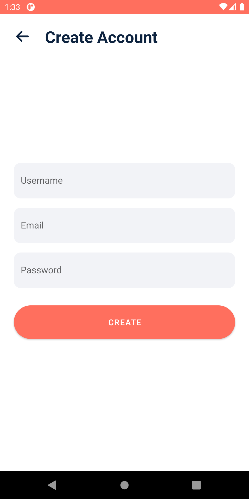
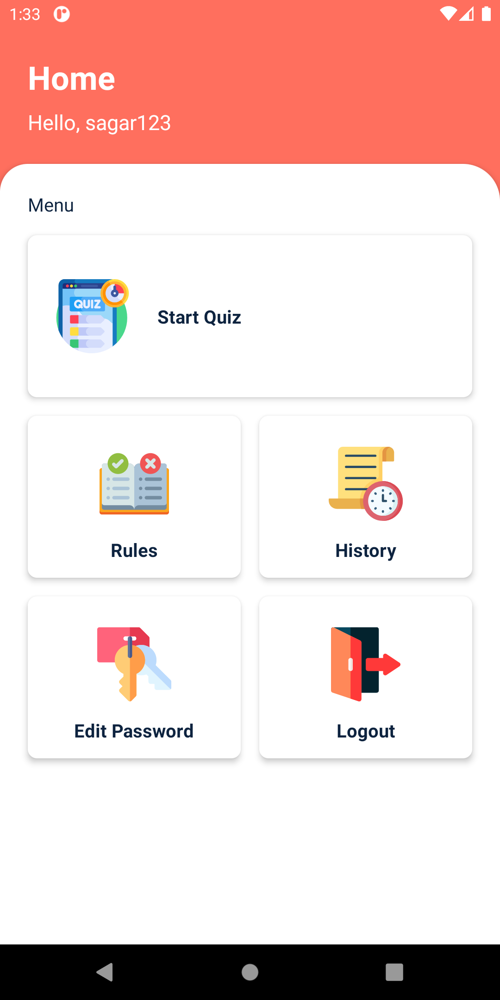
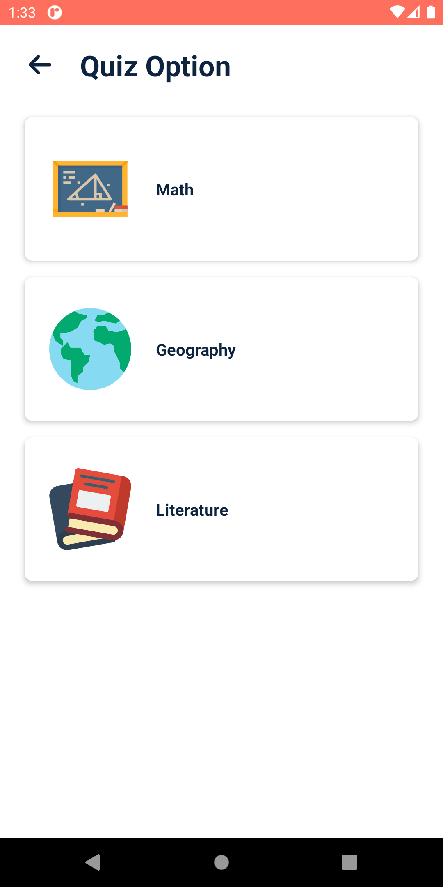
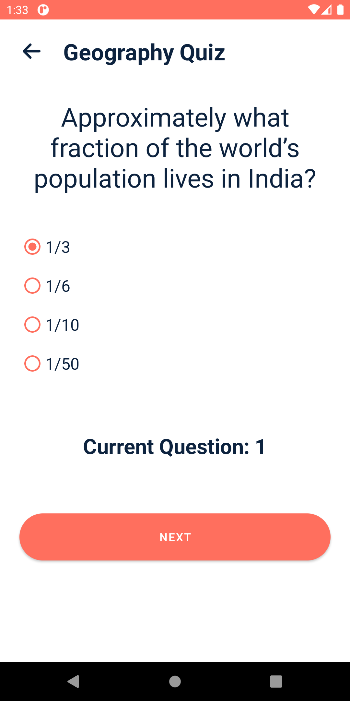
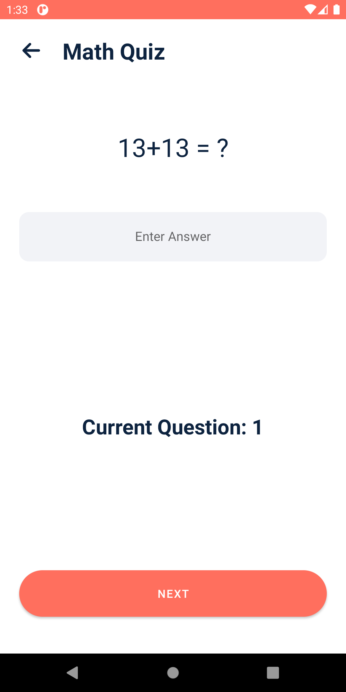
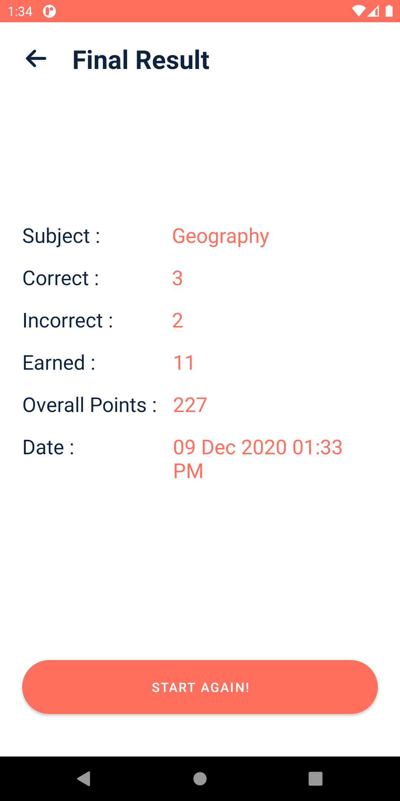
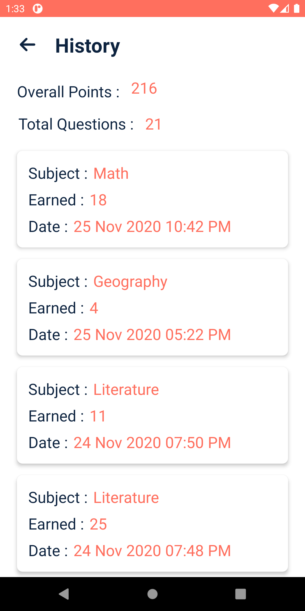
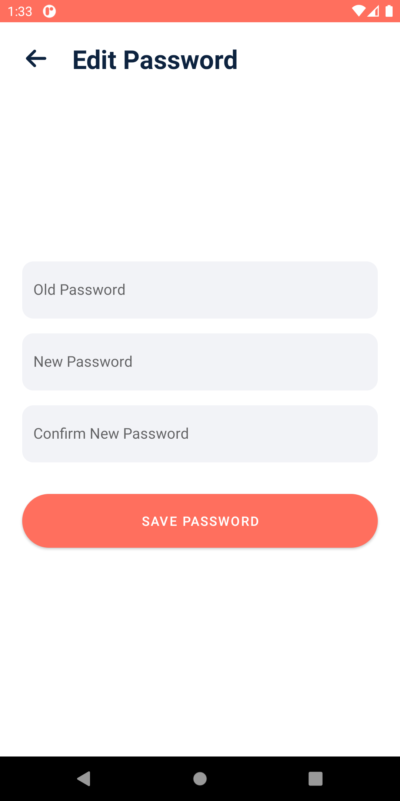

# Quiz App
A Quiz Android application 📱 built using Java ♨️ and showing best practices of 🛠️ Room

||||
|:----------------------------------------:|:-----------------------------------------:|:-----------------------------------------: |
|  |  |  |

|  |  |  |
|  |  |  |
|  |  |  |

## ⚙️ Detailed Functionality
* ESP for Pubg Mobile works by executing native CPP files with root access 
* 3 types of ESP 🎉
* Show Box : shows boxes around players within 500 metres range
* Display Rays : displays antena shape rays from players head which can be visbile within 500 metres range 
* Show items : shows all equipments arround you with names so you can loot faster than any one else 😉 
